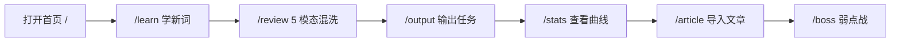

# 背单词网站 产品需求文档（PRD）

## 1. Product Overview

一个基于九大记忆规律（间隔重复/提取练习/精细加工/双重编码/生成效应/情境编码/交错学习/元认知/心流注意力）的闭环背单词前端应用。

- 目标用户：对「看一眼就忘」已厌倦、愿意投入主动编码与提取练习的英语学习者
- 市场价值：把「背单词」从浏览行为改为强制的测试/输出行为，显著降低被动遗忘

## 2. Core Features

### 2.1 Feature Module

1. **Dashboard（首页）**：今日目标、连击、新:旧比例、心流曲线、快捷入口
2. **Learn（学习新词）**：DeepCard（英英→词根→中文第二屏）、发音先行、JOL 预估、自由涂鸦、进入间隔队列
3. **Review（复习-测试）**：5 种提取模态自动混洗（en→cn / cn→spell / listen→spell / cloze / speak）、FlowTimer 限时、答错重置间隔
4. **Output（输出闭环）**：造句 / 词块拼装，不输入则不前进
5. **Article（语料导入）**：粘贴文章→自动提取生词→绑定原句
6. **Boss（弱点 Boss 战）**：lapses 高的词专项练习
7. **Stats（统计）**：近 14 天柱状图、个人记忆曲线折线
8. **Library（词库）**：内置 500 词、JSON 导入、浏览/搜索
9. **Settings（设置）**：每日目标、深浅主题、自动朗读首屏、限时秒数、新:旧比例
10. **NotFound**：404 兜底

### 2.2 Page Details

| Page Name | Module Name | Feature description |
|-----------|-------------|---------------------|
| Dashboard | Today Queue | 显示今日新学/复习数、连击天数、新:旧比例、快捷入口按钮；支持进入 Learn / Review / Boss |
| Learn     | DeepCard + JOL + Doodle | 卡片默认正面：发音按钮 + 英文 + 英英释义 + 词根；中文释义需点击揭示；用户可预估难中易、自由涂鸦后入队 |
| Review    | 5 Mode Interleave + FlowTimer | 5 种模态按权重交错出现；每题限 3–5 秒；答错重置间隔；答对 2 次后视为可能已掌握 |
| Output    | Sentence + Chunk | 用户自造句、词块拼装；每次复习组结束后至少一次输出任务 |
| Article   | Import + Extract | 粘贴文章 → 分词 → 过滤已学 → 绑定原句 → 导入为生词 |
| Boss      | Weakness Fight | lapses 高的词汇集为 Boss；连对 3 次出池 |
| Stats     | Chart + Curve | SVG 柱状图 + 个人记忆曲线折线；显示累计、正确率、连击 |
| Library   | Browse + Import | 浏览词库、按 tag 过滤、支持按 Word 接口的 JSON 导入 |
| Settings  | Prefs + Theme | dailyGoal / theme / defaultCnHidden / autoSpeakFirst / flashCardSecs / newOldRatio |
| NotFound  | Fallback | 404，提供返回首页入口 |

## 3. Core Process

用户路径：打开首页 → 进入 `/learn` 学 5–10 个新词（DeepCard + JOL + Doodle）→ 进入 `/review` 做 5 种模态交错的复习题（限时 FlowTimer）→ 触发 `/output` 做一次输出 → 观察 `/stats` 曲线 → 在 `/article` 导入新文章提取生词 → 在 `/boss` 专门训练高 lapses 词。

## 4. User Interface Design

### 4.1 Design Style

- **主基调**：旧书店 + 学术论文感。拒绝紫蓝渐变/糖果色。
- **色彩**：背景 `#F4EFE3`（奶黄纸）→ 深色 `#18160F`（墨夜）；字色 `#1A1A1A` → 深色 `#E8E0C9`；主色 `#2F4F4F`（暗青绿）；警示 `#8B2635`（酒红）；高亮 `#D4A017`（赭金）。
- **字体**：标题 Fraunces（衬线）；正文 Lora；中文正文 Noto Serif SC；音标 JetBrains Mono。
- **按钮/卡片**：纸质感圆角卡片；按钮方形感轻微圆角；hover 用颜色过渡，不使用强烈形变。
- **布局**：最大内容宽度 1180px；桌面侧栏/移动顶部 Tab；大量留白 + 细线分割。
- **动效**：卡片 fade-up 420ms cubic-bezier(.2,.7,.2,1) 带 stagger；翻转 perspective(1200px) rotateY(180deg)；阶段升级 SVG 粒子；禁止花哨弹窗。
- **图标**：lucide-react 统一线性图标。

### 4.2 Page Design Overview

| Page Name | Module Name | UI Elements |
|-----------|-------------|-------------|
| Dashboard | Today Panel | 顶部 Header、左侧 2 列统计卡（目标/连击）、右侧心流曲线、下方快捷入口 |
| Learn     | DeepCard Stack | 居中卡片、顶部发音按钮、英文/英英/词根三栏、第二屏中文揭示、底部 JOL + DoodlePad + 进入队列 |
| Review    | Question Card | 题面（按模态变化）、FlowTimer 倒计时、4 选 1/输入框、提交反馈、下一题 |
| Output    | Sentence Box | 中文提示 + 词块拖拽 + 输入框 + 提交 |
| Article   | Import + List | 大文本域粘贴、提取结果列表（词 + 原句），导入按钮 |
| Boss      | Arena | Boss 进度条 + 单词问题卡 + 连对计数 |
| Stats     | Chart Area | 标题 + 柱状图 + 折线图 + 摘要统计 |
| Library   | Table / Grid | 搜索框 + tag 过滤 + 导入按钮 + 词卡网格 |
| Settings  | Form Panel | 分组表单（目标/主题/语音/限时/新:旧），切换即时生效 |
| NotFound  | Minimal | 居中"迷路"插画感文字 + 返回首页 |

### 4.3 Responsiveness

- Desktop-first；`sm/md/lg` 断点
- ≤390px 单列、卡片占满宽；横向无滚动
- 键盘导航：空格=揭示/下一题；← →=不熟/熟；Enter=确认提交

### 4.4 可访问性

- 色彩对比度 ≥ 4.5（WCAG AA）
- `<button>` 语义化 + `aria-label`
- 深色模式完整覆盖所有主要色
