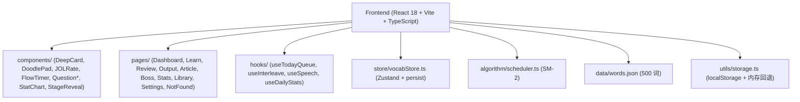
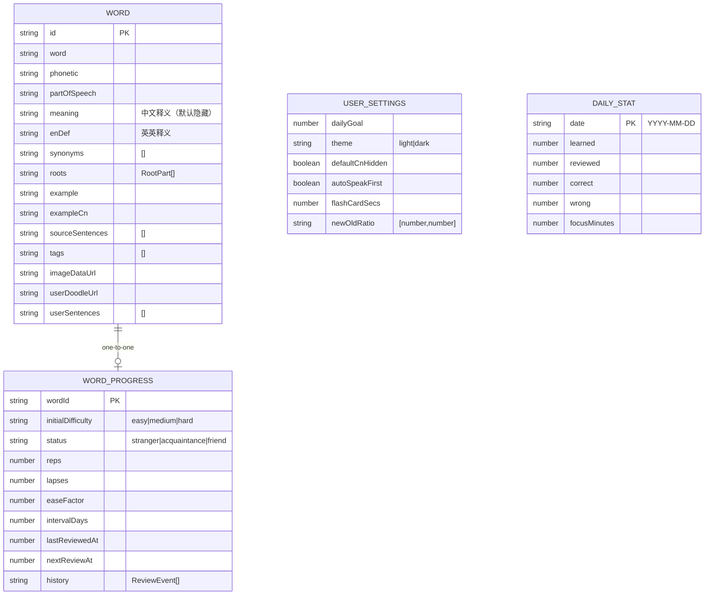

# 背单词网站 技术架构文档

## 1. Architecture Design



## 2. Technology Description

- Frontend: **React 18 + TypeScript + Vite 5**
- 样式: **Tailwind CSS 3**（自定义 colors / fontFamily）
- 状态管理: **Zustand 4 + persist middleware**（localStorage）
- 路由: **React Router v6**（非 lazy）
- 图标: **lucide-react**
- 算法: **SM-2 简化自适应版**（score 0–5 驱动 intervalDays / easeFactor / status 跃迁；拒绝固定 1/3/7/15）
- 语音: **Web Speech API**（浏览器内可用；若无语音包降级为仅显示文字，不报错）
- 涂鸦: **Canvas 2D**，存 DataURL（限 500KB，自动压缩）
- Backend: None（Phase 1 纯前端 SPA）

## 3. Route Definitions

| Route | Page | Purpose |
|-------|------|---------|
| `/` | Dashboard | 今日队列、目标、连击、心流曲线、快捷入口 |
| `/learn` | Learn | 学新词：英英→词根→中文第二屏 + JOL + Doodle |
| `/review` | Review | 5 模态混洗复习，FlowTimer 限时 |
| `/output` | Output | 造句 / 词块拼装 |
| `/article` | Article | 粘贴文章，自动提取生词并绑定原句 |
| `/boss` | Boss | 高 lapses 词的弱点战 |
| `/stats` | Stats | 柱状图 + 个人记忆曲线 |
| `/library` | Library | 词库浏览 + 搜索 + JSON 导入 |
| `/settings` | Settings | 每日目标/主题/语音/限时/新:旧比例 |
| `*` | NotFound | 404 兜底 |

## 4. Data Model



### 4.1 TypeScript 类型

```ts
export type QuestionMode =
  | "en→cn" | "cn→spell" | "listen→spell" | "cloze" | "speak";

export interface RootPart {
  root: string;
  meaning: string;
  relatedWords?: string[];
}

export interface Word {
  id: string;
  word: string;
  phonetic?: string;
  partOfSpeech?: string;
  meaning: string;
  enDef: string;
  synonyms?: string[];
  roots?: RootPart[];
  example: string;
  exampleCn?: string;
  sourceSentences?: string[];
  tags?: string[];
  imageDataUrl?: string;
  userDoodleUrl?: string;
  userSentences?: string[];
}

export interface ReviewEvent {
  at: number;
  mode: QuestionMode;
  score: 0 | 1 | 2 | 3 | 4 | 5;
  jol: boolean;
  responseMs: number;
}

export interface WordProgress {
  wordId: string;
  initialDifficulty: "easy" | "medium" | "hard";
  status: "stranger" | "acquaintance" | "friend";
  reps: number;
  lapses: number;
  easeFactor: number;
  intervalDays: number;
  lastReviewedAt: number;
  nextReviewAt: number;
  history: ReviewEvent[];
}

export interface UserSettings {
  dailyGoal: number;
  theme: "light" | "dark";
  defaultCnHidden: boolean;
  autoSpeakFirst: boolean;
  flashCardSecs: number;
  newOldRatio: [number, number];
  activeLibraryTag: string;
}

export interface DailyStat {
  date: string;
  learned: number;
  reviewed: number;
  correct: number;
  wrong: number;
  focusMinutes: number;
}
```

## 5. 项目目录结构

```
/workspace
├── index.html
├── package.json
├── tsconfig.json
├── vite.config.ts
├── tailwind.config.js
├── postcss.config.js
└── src/
    ├── main.tsx, App.tsx, index.css
    ├── types/index.ts
    ├── data/words.json
    ├── algorithm/scheduler.ts
    ├── utils/storage.ts
    ├── hooks/ (useTodayQueue, useInterleave, useSpeech, useDailyStats)
    ├── store/vocabStore.ts
    ├── components/ (NavBar, DeepCard, DoodlePad, JOLRate, FlowTimer, StageReveal,
    │               ChoiceQuestion, SpellQuestion, ClozeQuestion, SpeakAndRate,
    │               ProgressBar, StatChart, EmptyState)
    └── pages/ (Dashboard, Learn, Review, Output, Article, Boss, Stats, Library, Settings, NotFound)
```

## 6. 关键算法与约束

- **SM-2**：`score` 0–5；答对 ≥3 时 `intervalDays` 指数扩展；答错 ≤2 时 `intervalDays` 重置为 1 并 `lapses += 1`；`easeFactor = easeFactor - 0.8 + 0.28*score - 0.02*score*score`，下限 1.3。
- **交错学习**：新:旧 ≈ settings.newOldRatio 加权混洗；易错词（按 lapses）超额采样最多占当日队列 20–30%。
- **精细加工强制**：`defaultCnHidden = true`；中文释义必须点击揭示。
- **双重编码**：`autoSpeakFirst = true` 时进入 Learn/Review 题面后自动朗读英文。
- **持久化**：zustand persist + localStorage；存储超 4MB 时提示导出备份；Canvas DataURL 限 500KB。
- **时区**：`DailyStat.date` 使用本地时区 `YYYY-MM-DD`。
